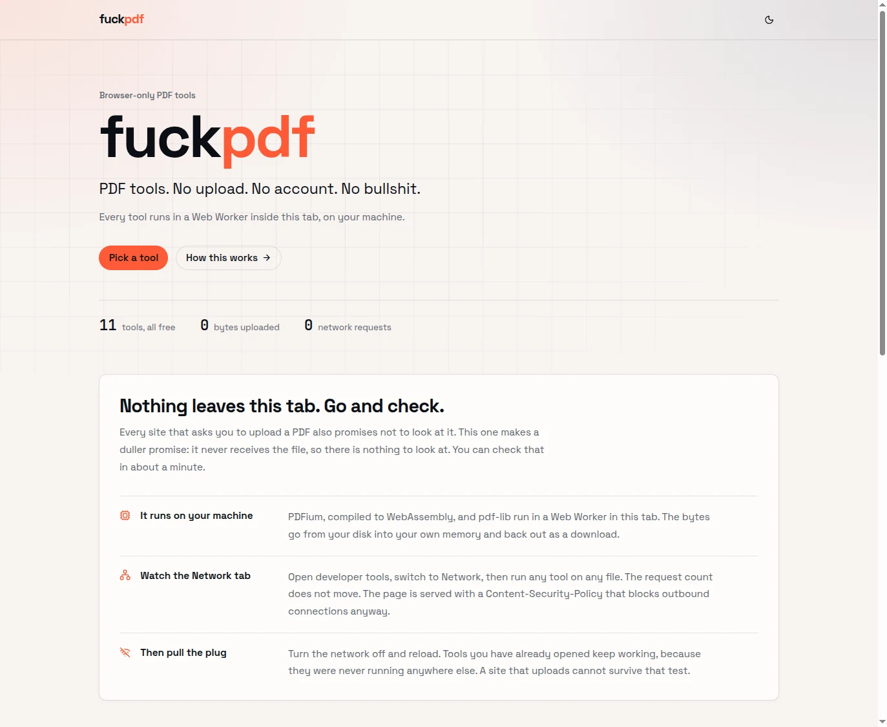
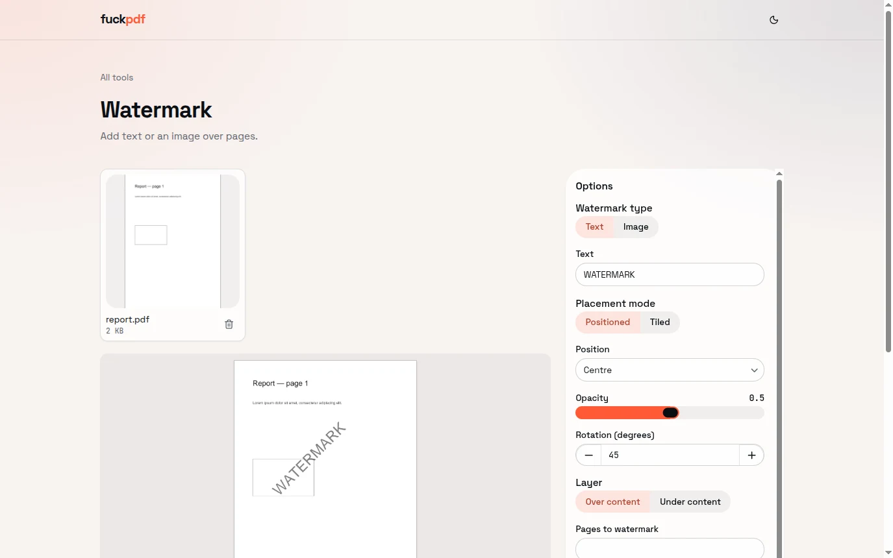
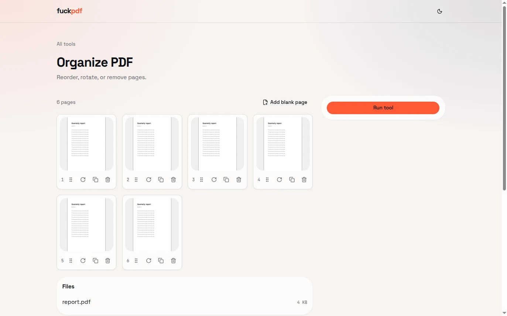

# fuckpdf

[](https://github.com/reqhiem/fuckpdf/actions/workflows/ci.yml)
[](LICENSE)

**PDF tools. No upload. No account. No bullshit.**

Eleven PDF tools that run entirely in your browser, on WebAssembly and Web Workers. Your
files are never sent anywhere, because there is nowhere to send them: no backend, no
accounts, no queue, no analytics, no cookies, no third-party requests.

**Live:** <https://fuckpdf.joel-perca.workers.dev>. The same build also answers on
<https://fuckpdf.reqhiem.dev>.

<picture>
  <source media="(prefers-color-scheme: dark)" srcset="docs/screenshots/landing-dark.webp">
  
</picture>

| A tool page | The page grid |
| --- | --- |
|  |  |

## Why "nothing is uploaded" is true here, not just claimed

Every upload site says the same sentence. Four things in this repo make it checkable.

**There is no server to upload to.** [`wrangler.jsonc`](wrangler.jsonc) has no `main`:
Cloudflare serves the built files as static assets, so there is no Worker script, no
route, and no code of ours running anywhere but your tab.

**The browser is told it may not talk to anyone else.**
[`apps/web/public/_headers`](apps/web/public/_headers) ships a CSP with
`default-src 'self'` and `connect-src 'self'`, plus `object-src 'none'`, `base-uri
'none'`, `form-action 'none'` and `frame-ancestors 'none'`. An accidental `fetch` to a
third party does not get sent quietly, it gets blocked. The PDFium `.wasm` binary and
both fonts are served from this origin for the same reason; nothing is pulled from a CDN.

**A test fails the build if that ever changes.**
[`e2e/tests/zero-egress.spec.ts`](e2e/tests/zero-egress.spec.ts) loads the landing page
and a tool route, records every request the page and its context make, and asserts that
none of them has an origin other than the app's. It runs in CI on Chromium, Firefox and
WebKit.

**You can check it yourself in ten seconds.** Open DevTools, go to the Network tab, run a
tool. Once the page and its engine chunk have loaded, running a tool adds nothing to that
list. Pull the ethernet cable and the tab keeps working. (Full offline, meaning
closing the tab and coming back with no network, needs a Service Worker, which is not
shipped yet.)

One thing this does not cover is documented below, in
[Privacy: what this does and does not cover](#privacy-what-this-does-and-does-not-cover).

## Tools

All eleven ship today and are asserted byte-for-byte in a real browser by
[`e2e/tests/tools.spec.ts`](e2e/tests/tools.spec.ts).

| Tool | Route | What it does | Engine |
| --- | --- | --- | --- |
| Merge PDF | `/merge` | Combine 2 to 1000 PDFs into one file, in the order you drop them | pdf-lib |
| Split PDF | `/split` | Break one PDF into pieces: custom ranges, every N pages, every page, or a maximum file size | pdf-lib |
| Remove pages | `/remove-pages` | Delete the pages you pick out of the grid | pdf-lib |
| Extract pages | `/extract-pages` | Keep only the pages you pick | pdf-lib |
| Organize PDF | `/organize` | Reorder by drag or keyboard, rotate, duplicate, delete, insert a blank page | pdf-lib + PDFium (thumbnails) |
| Rotate PDF | `/rotate` | 90/180/270, on all pages or a range | pdf-lib |
| Page numbers | `/page-numbers` | Nine position anchors, first number, page range, `{n}` / `{n} of {total}` templates, font, size, colour, margin | pdf-lib |
| Watermark | `/watermark` | Text or image, positioned or tiled, opacity, rotation, over or under the content, page range | pdf-lib |
| Crop PDF | `/crop` | Draw the box on a page; non-destructive by default, or `flatten` to rasterise it in | pdf-lib (+ PDFium when flattening) |
| JPG to PDF | `/jpg-to-pdf` | JPEG or PNG in, one PDF out: A4, Letter or fit-to-image, orientation, margin, fit mode | pdf-lib |
| PDF to JPG | `/pdf-to-jpg` | Every page as JPEG, PNG or WebP at 72 to 300 DPI, zipped | PDFium |

Every tool runs with zero options touched. Options refine a result; they never gate one.

Not shipped yet, and not pretended otherwise: Protect, Unlock, Sign, Redact, Forms, Edit,
Compress, Repair, OCR. See [`.context/ROADMAP.md`](.context/ROADMAP.md).

## Quick start

Requires Node >= 20.19 and pnpm (the version is pinned in `package.json`'s
`packageManager` field, so Corepack picks it up).

```bash
pnpm install
pnpm dev
```

The full gate, exactly as CI runs it:

| Command | What it checks |
| --- | --- |
| `pnpm lint` | Biome, lint and format |
| `pnpm typecheck` | `tsc -b --noEmit`, strict |
| `pnpm test` | Vitest: every tool step and the PDFium adapter, in Node |
| `pnpm build` | Vite production build to `apps/web/dist` |
| `pnpm budget` | Shell JS under 200 KB gzip, and no engine chunk in it |
| `pnpm e2e` | Playwright: the eleven tools, the shell, and the zero-egress assertion |

`pnpm e2e` needs browsers: `pnpm --filter e2e exec playwright install --with-deps`. The
per-tool suite runs on Chromium only, because it asserts output bytes, which come out of
the same wasm in every browser. The shell and zero-egress specs run on all three.

## Architecture

A file never leaves the tab, and inside the tab it never touches the main thread as
anything but a transfer:

```
drop → File.arrayBuffer() → Comlink transfer → Web Worker
                                                 ├── PDFium (wasm): render, text, images
                                                 └── pdf-lib (JS):  structure
                                             → output bytes → Blob → <a download>
```

Four rules hold the thing together, and each one is enforced by something that fails:

- **Every tool is a pure step.** `run(inputs, options, ctx) => Promise<Output[]>`, with no
  DOM, no React, no globals. That is why `packages/tools` is testable under Node in CI,
  and why chaining tools later is a UI problem rather than a rewrite.
- **Engines are lazy.** `packages/tools/src/registry.ts` holds one bare dynamic import per
  tool; `vite.config.ts` splits PDFium and pdf-lib into their own chunks. `pnpm budget`
  fails if an engine chunk ends up in `index.html`.
- **PDF bytes are transferred, not cloned.** Copying a 200 MB scan to hand it to a worker
  costs 200 MB and a frame drop.
- **PDFium is the only renderer.** No MuPDF, no second rasteriser.

```
apps/web            SPA: routes, shell, tool pages, worker RPC
packages/ui         design system (HeroUI v3 seam, Dropzone, ThemeToggle). No PDF logic.
packages/tools      the eleven pure tool steps. Node-testable, no DOM.
packages/engine-pdfium  PDFium wasm adapter. Node-testable.
e2e/                Playwright
scripts/            bundle budget check
.context/           PRD, decisions, roadmap, architecture (project management, not code)
```

The long version, including why `packages/engine-pdflib` does not exist, is in
[`.context/ARCHITECTURE.md`](.context/ARCHITECTURE.md).

## Deployment

Cloudflare Workers, static assets only. `wrangler.jsonc` points `assets.directory` at
`apps/web/dist` with SPA fallback and declares no `main`, so a deploy uploads files and
nothing else: zero Worker invocations, zero server code.

[`.github/workflows/deploy.yml`](.github/workflows/deploy.yml) builds and runs `wrangler
deploy` on every push to `main`, with `WRANGLER_SEND_METRICS=false` because a project
whose whole claim is that nothing is measured should not be measured by its own build
tool either. The deploy step is skipped, not failed, when the Cloudflare credentials are
absent.

## Privacy: what this does and does not cover

**Covered.** No file, no file name, no page count and no option you pick ever leaves the
browser. There is no account, no session, no cookie, no analytics, no error reporting and
no beacon. The only thing persisted is your theme choice, in `localStorage`.

**Not covered, and worth knowing:** the deployed origin returns Cloudflare's own `nel` and
`report-to` headers, pointing the browser at `a.nel.cloudflare.com`. They are injected by
the edge, not by `public/_headers`, so the application cannot remove them. `success_fraction`
is `0.0`, so a browser reports *network failures* only, never a successful visit.
It is still a third-party endpoint a browser may contact, which the zero-egress
claim does not get to ignore. Network Error Logging is a zone-level setting; turning it
off needs a controlled zone bound to the Worker, and it cannot be turned off on a
`workers.dev` subdomain. The Playwright test cannot catch this either: NEL only fires on a
network error, which a passing run never produces. The check is `curl -I` against the
deployed origin, and the acceptance criterion is the header being gone. Tracked in
[`.context/ROADMAP.md`](.context/ROADMAP.md).

**Also worth knowing:** this is a static site, so your ISP and the CDN still see that you
loaded it, the same as any other page. They do not see what you did with it.

## License

MIT. See [LICENSE](LICENSE). [`.context/DECISIONS.md`](.context/DECISIONS.md) (D1, D5)
records why, and the one thing that would change it.

Built on work by other people:
[PDFium](https://pdfium.googlesource.com/pdfium/) via
[`@embedpdf/pdfium`](https://github.com/embedpdf/embed-pdf-viewer) (BSD / MIT wrapper),
[pdf-lib](https://github.com/Hopding/pdf-lib) (MIT),
[fflate](https://github.com/101arrowz/fflate) (MIT),
[HeroUI](https://github.com/heroui-inc/heroui) (MIT) on
[React Aria](https://github.com/adobe/react-spectrum) (Apache-2.0),
[dnd-kit](https://github.com/clauderic/dnd-kit) (MIT),
[lucide](https://github.com/lucide-icons/lucide) (ISC),
[Comlink](https://github.com/GoogleChromeLabs/comlink) (Apache-2.0),
[i18next](https://github.com/i18next/i18next) (MIT),
[Zustand](https://github.com/pmndrs/zustand) (MIT), and the
[Space Grotesk](https://github.com/floriankarsten/space-grotesk) and
[JetBrains Mono](https://github.com/JetBrains/JetBrainsMono) typefaces (OFL).

## Contributing

[CONTRIBUTING.md](CONTRIBUTING.md). Read [AGENTS.md](AGENTS.md) first: it lists the
invariants, and breaking one is a bug rather than a preference.
